# Week 7: Lab Report 4 #

```
1. Vim TestDocSearch.java
2. /Start
3. D
4. W
5. I
6. "Base"
7. <Esc>
8. N
9. D
10. W
11. I
12. "Base"
13. <Esc>
14. N
15. D
16. W
17. I
18. "Base"
19. <Esc>
20. N
21. D
22. W
23. I
24. "Base"
25. <Esc>
26. :wq 
27. <Enter>
```
---
## Visualization ##

### First Start Removal ###

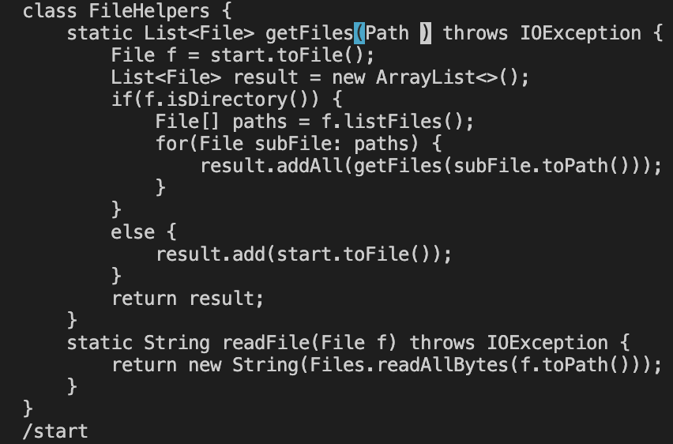
- code lines 3-4 

- Here I am deleting "start" with the d key and the w key brings my cursor to the beginning of (Path )

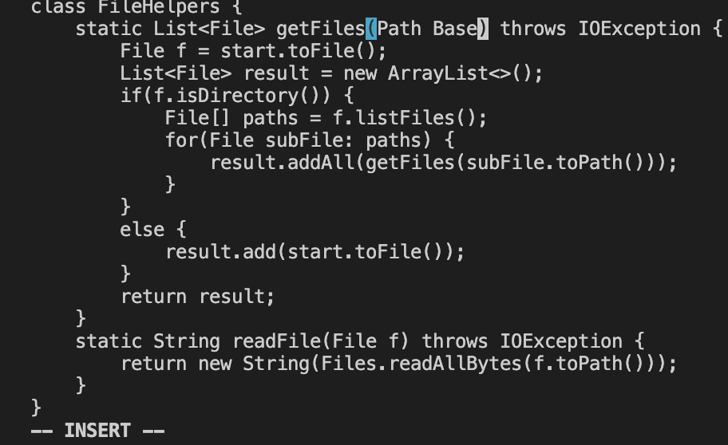
- code lines 5-6

- Press i key to insert and type "Base"

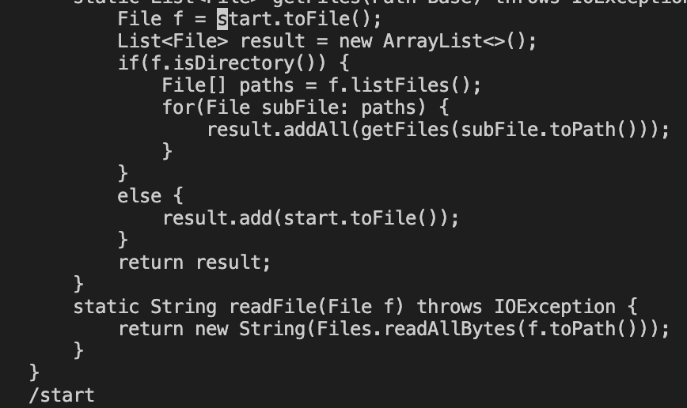
- code lines 7-8 

- Pressing <Esc> to get out of insert mode and typing n to go back into searching for "/start"

---

### Second Start Removal ###

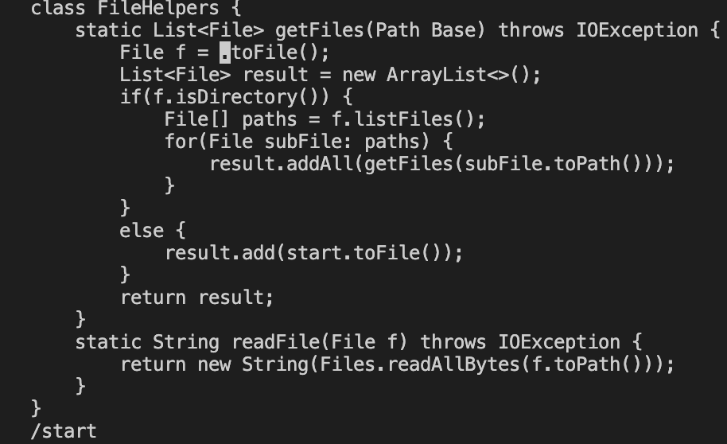
- code lines 9-10 
 
- Back to deleting "start" with d and having my cursor at the highlighted area when pressing w 

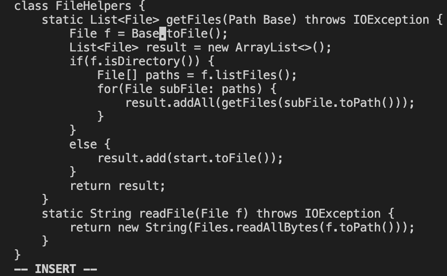
- code lines 11-12
  
- Press i key to insert and type "Base"

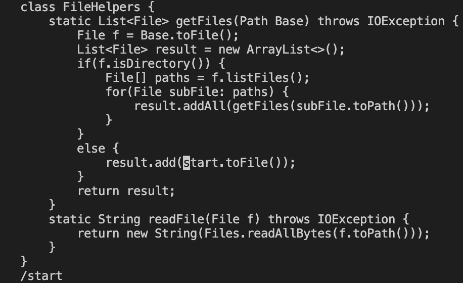
- code lines 13-14
  
- Pressing <Esc> to get out of insert mode and typing n to go back into searching for "/start"

---

### Third Start Removal ###

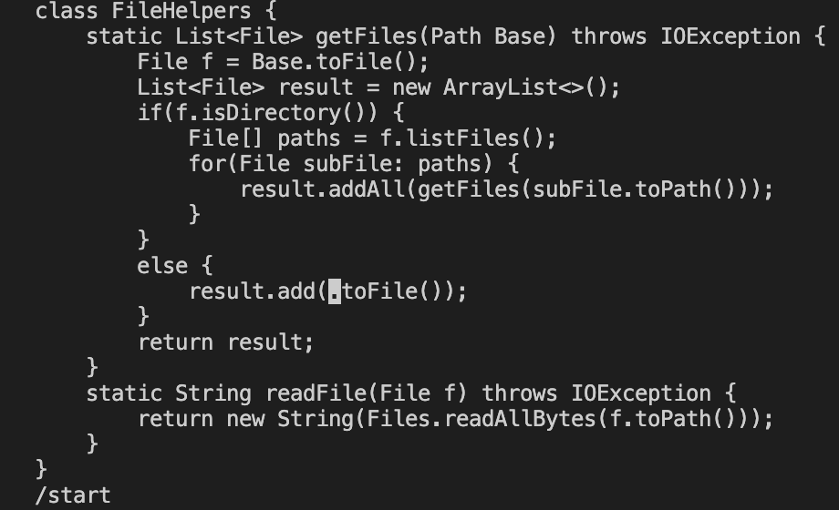
- code lines 15-16
  
- Back to deleting "start" with d and having my cursor at the highlighted area when pressing w


- code line 17-18
  
- Press i key to insert and type "Base"

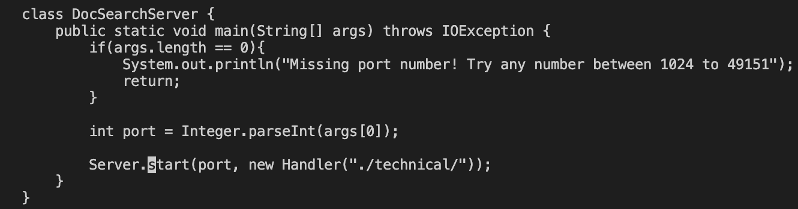
- code line 19-20
  
- Pressing <Esc> to get out of insert mode and typing n to go back into searching for "/start"

---

### Last Start Removal ###

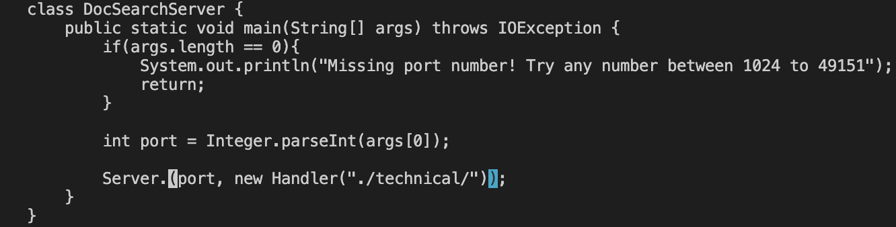
- code lines 21-22
  
- Back to deleting "start" with d and having my cursor at the highlighted area when pressing w

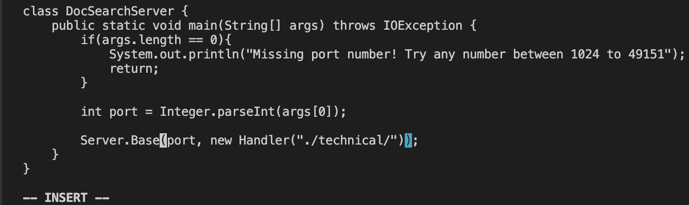
- code lines 23-24
  
- Press i key to insert and type "Base"

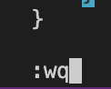
- Here everything is running accordingly to the code from way above I just accidentally scrolled up on the code after pressing <Esc>
  
- code lines 25-26 
  
- here I type in :wq to save and close and press <Enter>

---
# Part 2 #

- This part took me around an hour to do (60 minutes or 3,600 seconds)
- It took me this long because I was getting confused with other files since the skill-demos we have been using have files with very similar names. I accidentally vimmed into TestDocSearch.java instead of DocSearchServer.java

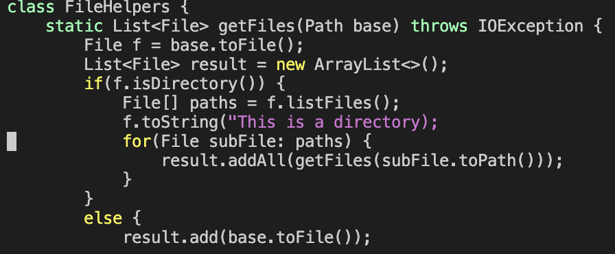
- this is a screenshot I took when I vimmed in and was messing around with the file from a remote computer. 
  
- Out of the two styles, I think I prefer the second option which was making the edits in vim while in a ssh session. I like this better because I can see the charm and efficiency of vim. It is a lot more easier to navigate with and it also helps that the remote computer highlights and colors different key terms. 
  
- If I had a really big project like maybe a massive PA to complete I would consider using vim as I don't have to manually find all the files and I can also use the useful commands like "/search". In plain VS Code I sort of have to find everything manually and don't use any "cheat codes" like d,w,i. 
  
- If I had to do a small assignment that involves a few lines of code I would do it regularly on VS Code since I don't need all the fancy commands. 
