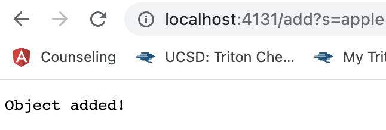
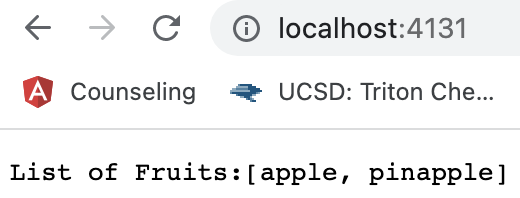
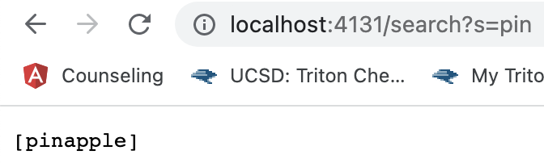
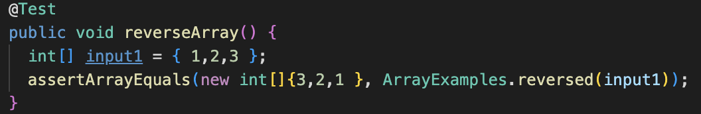
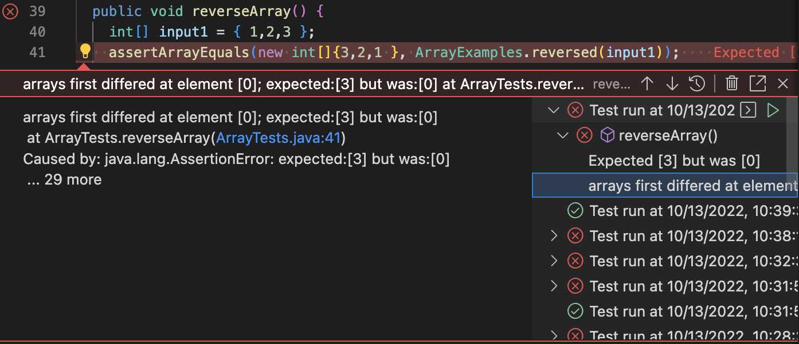
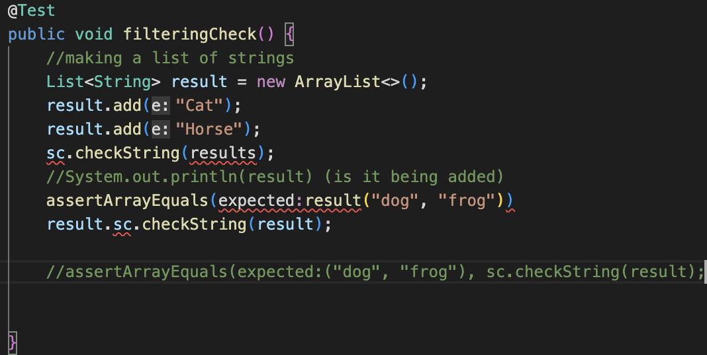
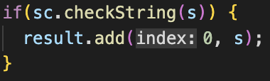

# Week 3: Lab 2 #

**Part 1**

- Code from Simple Search Engine:
```
class Handler implements URLHandler {
    ArrayList<String> fruitList = new ArrayList<String>();

    public String handleRequest(URI url) {

        if (url.getPath().equals("/")) {
            return String.format("List of Fruits:" + fruitList);
        } else {
            System.out.println("Path: " + url.getPath());

            if (url.getPath().contains("/add")) {
                fruitList.add(url.getQuery().split("s=")[1]);
                return String.format("Object added!");
            }

            if (url.getPath().contains("/search")) {
                String[] parameters = url.getQuery().split("=");
                ArrayList<String> search_results = new ArrayList<>();
                if (parameters[0].equals("s")) {
                    for (String fruit: fruitList) {
                        if (fruit.contains(parameters[1])) {
                            search_results.add(fruit);
                            return search_results.toString();
                        }
                    }
                }
                //return String.format("Object added!", parameters[1], search_results);
                return fruitList.toString();
                


            }
            return "404 Not Found!";
        }
    }
}

class FruitServer {
    public static void main(String[] args) throws IOException {
        if(args.length == 0){
            System.out.println("Missing port number! Try any number between 1024 to 49151");
            return;
        }

        int port = Integer.parseInt(args[0]);

        Server.start(port, new Handler());
    }
}
```


- Methods being called: What I think is being called is from ".equals("/") all the way to then end of .contains("/add). I say this because when I was editing the url I added "/add?s=apple" (as you can see on the top of the screenshot) and then my code "return String.format("Object added!");" runs so I see "object added" being displayed
- Values: I am not entirely sure what values refer to but I would assume it would have to do with how the methods are implemented. When I referred to the "/" of a url I had to utilize the .getPath() method to know what the program want to look at and then use .equals to see if it matched up to a string. This would indicate where the path is starting
    - to actually be able to do the code for /add I had to use url.getPath().contains("/add") to get the path of the url and then check if the user wanted to add items 
- I wouldn't say the values change but they switch off based on where they are in the code so after an item is added the user would remove the /add?s=(apple) to (localhost:4131) and then the system would print out the default "List of Fruit:" and what fruits have been added for now



- Methods being called: I think here only this is being used because the user is not adding nor searching for anything therefore the default localhost page is displaying the *updated* "List of Fruits:" and the current count.
```
if (url.getPath().equals("/")) {
            return String.format("List of Fruits:" + fruitList);
        } else {
            System.out.println("Path: " + url.getPath());
``` 
- Values: values relevant to this would be the updating of fruitlist and making sure the URL no longer contains add, search, or another form of path. 

- The only values that would change here are the ones I just previously mentioned because if /add?s=Kiwi is used then the default page has to make sure it updates to be [apple,pinapple, Kiwi]. So these values are important to the formatting and display of the general localHost port 



- Methods being called: I would assume this section of my code is being used because the program has to check if the url contains "search" to properly do what it is programmed to do. When it checks the url if it contains search then thats when it loops into the list and then has to figure out what item to return. For example, here I searched "pin" and then the default localhost page would return [pinapple] because the string "pin" is inside of it. 
```
if (url.getPath().contains("/search")) {
                String[] parameters = url.getQuery().split("=");
                ArrayList<String> search_results = new ArrayList<>();
                if (parameters[0].equals("s")) {
                    for (String fruit: fruitList) {
                        if (fruit.contains(parameters[1])) {
                            search_results.add(fruit);
                            return search_results.toString();
                        }
```

- Values: What would be relevant to /search would be the overall stance of the arraylist (fruitList) and what string is being searched within the array. Search is all about looking into the array list of items that already exist in there so it's very reliant on what the /add?s=(item) does and if it's working as well as if the items are being displayed and saved. 

- If these values were to change then it would impact the outcome of /Search because search has to look through items that are already existing and in the fruitList. If something were to go wrong in /add then it would in a sense impact /search because it would not be able to search for fruit that was badly added onto the list. 

---

**Part 2**
 
Bug #1
- for the ArrayExamples.java file a bug that I had found interesting was the reversed method because it was not reversing at all. 

-Failure-inducing input:


-The Symptom:


-The Bug: 
```
arr[i]=newArray[arr.length-i-1];
```
-The connection between the symptom and the bug is that the symptom is error message that I got thanks to my JUnit test. This test case showed me the error which I was getting which in the image says my list was not being reversed correctly or reversed at all for that matter. It relates back to the bug because the bug is the source of this error. I got rid of this symptom by fixing the bug and the issue was that the newArray was being declared to be the old array when it should have been the opposite. You want to print out the new reversed array.

---
Bug #2

-Failture-inducing input: I was not able to figure out how to use the sc.checkString(s) method so I was not able to finish up this section but I do have my guesses and estimations. 


-The Symptom: I did not actually get to create a valid JUnit test and get a result 

-The Bug:(my best guess)


-The connection I would make between these two is that because the index of the array list is not incrementing and remains at "0" then it might not be updating properly or updates over an already existing string so it owuld be something like "dog" = "cat". If my guess is correct then the Symptom (the error that will be shown if I get to properly create the JUnit test) will show me what the code is doing wrong and I just have to edit the section of code that I highlighted. 

