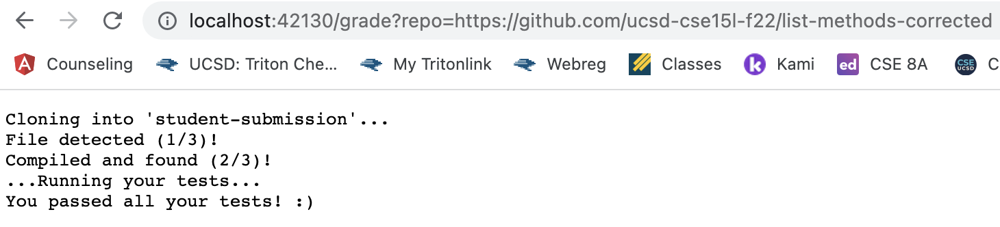
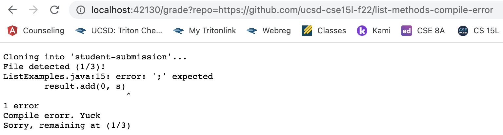
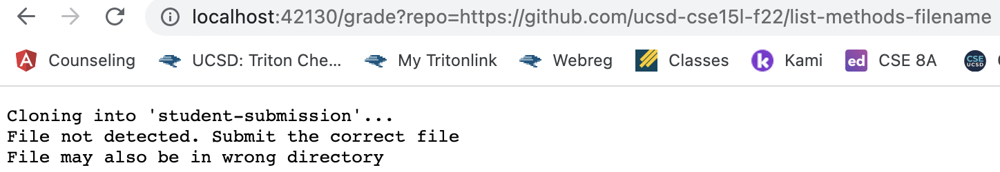

# Lab Report 5 #
---

#### grade.sh ####
```
#credit given to ashishjayamohan (https://github.com/ashishjayamohan/list-examples-grader)
#my code was inspired by theirs as I was giving them feedback on gradescope
CPATH=".:lib/hamcrest-core-1.3.jar:lib/junit-4.13.2.jar"
rm -rf student-submission
git clone $1 student-submission

cd student-submission

# checking if file exists 
if [[ -f "ListExamples.java" ]]
then 
    echo "File detected (1/3)!"
else 
    echo "File not detected. Submit the correct file"
    echo "File may also be in wrong directory"
    exit 1
fi
#checking if it compiles
javac -cp $CPATH *.java
if [[ $? -eq 0 ]]
then 
    echo "Compiled and found (2/3)!"
else
    echo "Compile erorr. Yuck"
    echo "Sorry, remaining at (1/3)"
    exit 2
fi 

java -cp $CPATH org.junit.runner.JUnitCore TestListExamples 2> output.txt
echo "...Running your tests..."
if [[ $? -eq 0 ]]
then
    echo "You passed all your tests! :)"
    exit
else 
    echo "Please check your tests and come back"
    echo "$(cat output.txt)"
    exit 3
fi
```

---

#### Screenshot #1 ####
https://github.com/ucsd-cse15l-f22/list-methods-corrected



---

#### Screenshot #2 ####
https://github.com/ucsd-cse15l-f22/list-methods-compile-error



---

#### Screenshot #3 ####
https://github.com/ucsd-cse15l-f22/list-methods-filename



---

## Explanation of Screenshot 2 ##

-To start off, grade.sh begins by changing the current directory to student-submission where is where we will be getting all the urls, files, and directories. 

-The first "if" statement states that if there is a file detected in ListExamples.java (through the -f command) then it will echo "File detected (1/3)!"

-Given the url, https://github.com/ucsd-cse15l-f22/list-methods-compile-error, the obvious error being that there is only a compilation error so the file should still be detected. Because the file is found my first else statement does not echo nor exit. 

-An error I made before was using exit 0 right after my successful echo message and it entirely ended my grade.sh there. I should not exit but continue on. I view grade.sh as a checklist. 

-The next statement (javac -cp $CPATH *.java) changes the classpath and locates the classes and packages 

-My second if statement checks if the last command produced a 0 exit code or not and since my code had not exit yet, it continues.

-However, because this url has a compilation error the grade.sh catches it and does not echo "Compiled and found (2/3)" but rather the else statement being "Compile eror. Yuck" along wih an additional echo statement

-This is then followed by an exit 2. I chose a non-zero number because a 0 would mean a successful exit. Anything that is non-zero would be a failure.

-Due to this early exit, the rest of my if statements do not run. I exited here if a file could not be compiled but if it was it would grade.sh would evaluate the tests the user ran.


