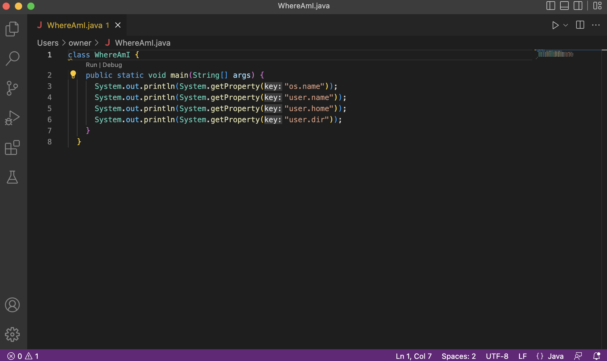
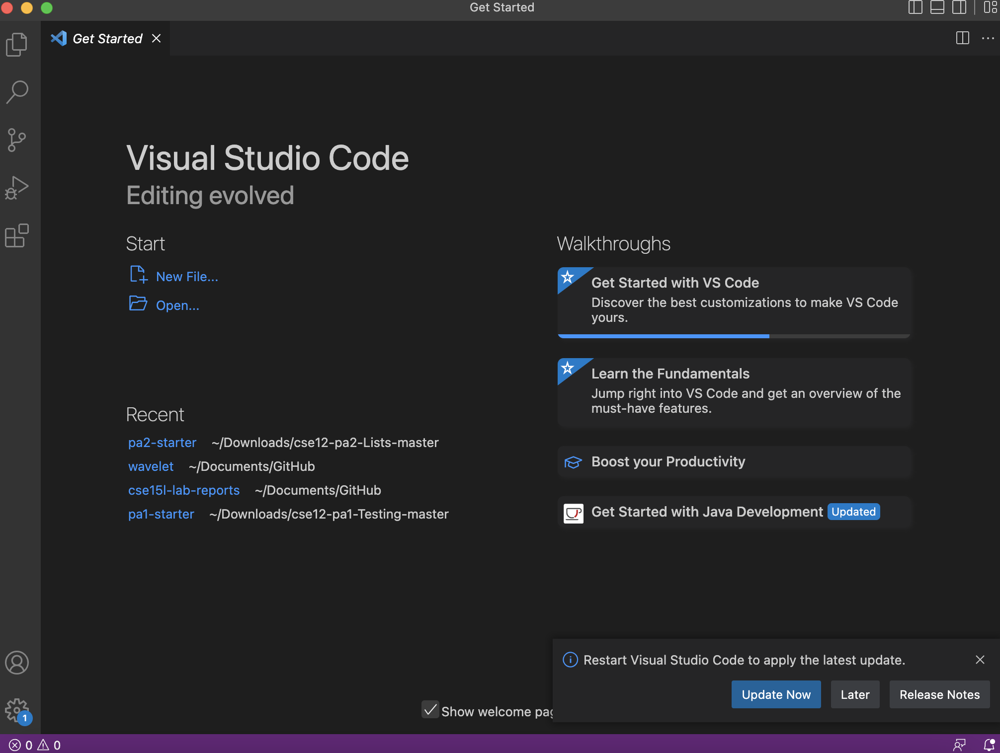
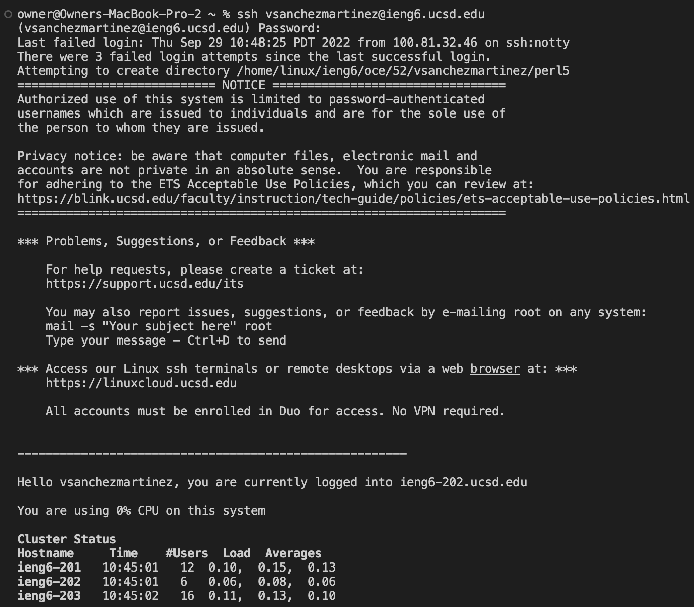
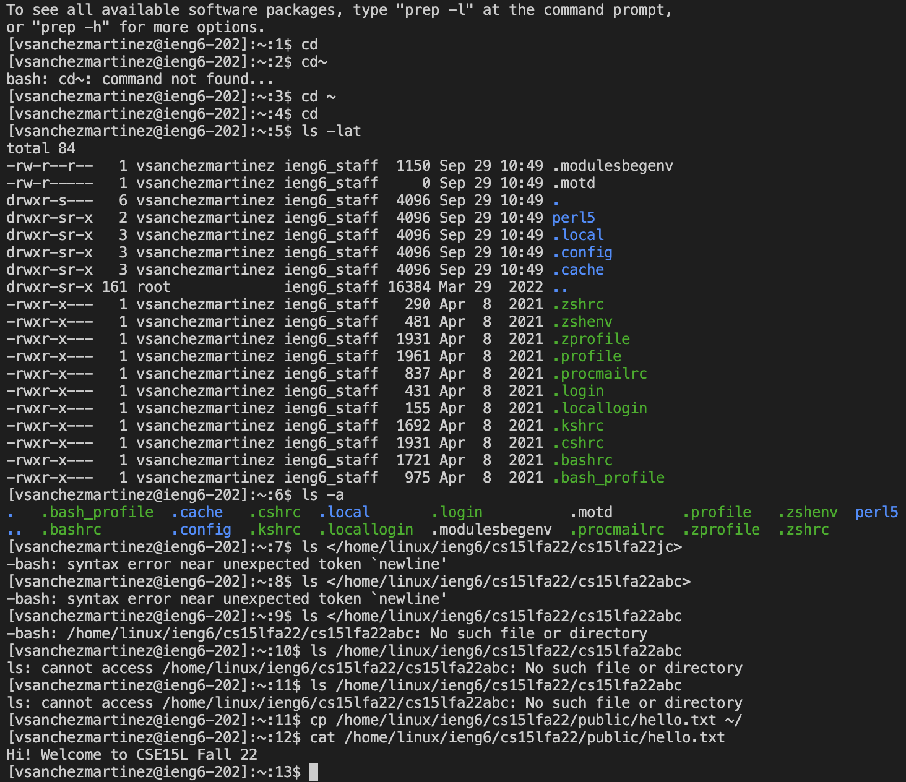
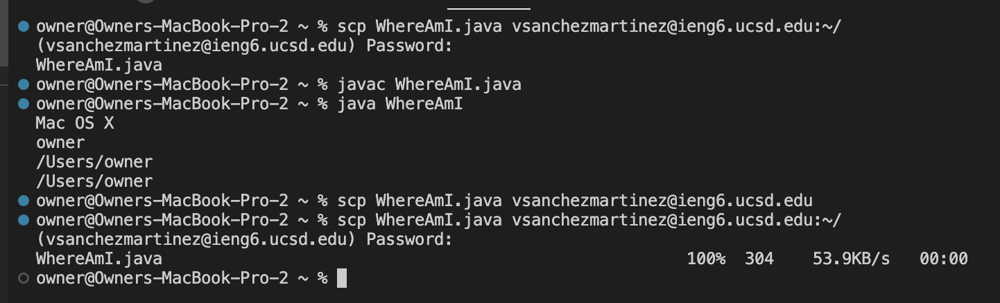
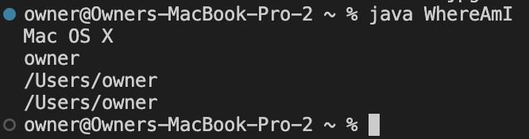
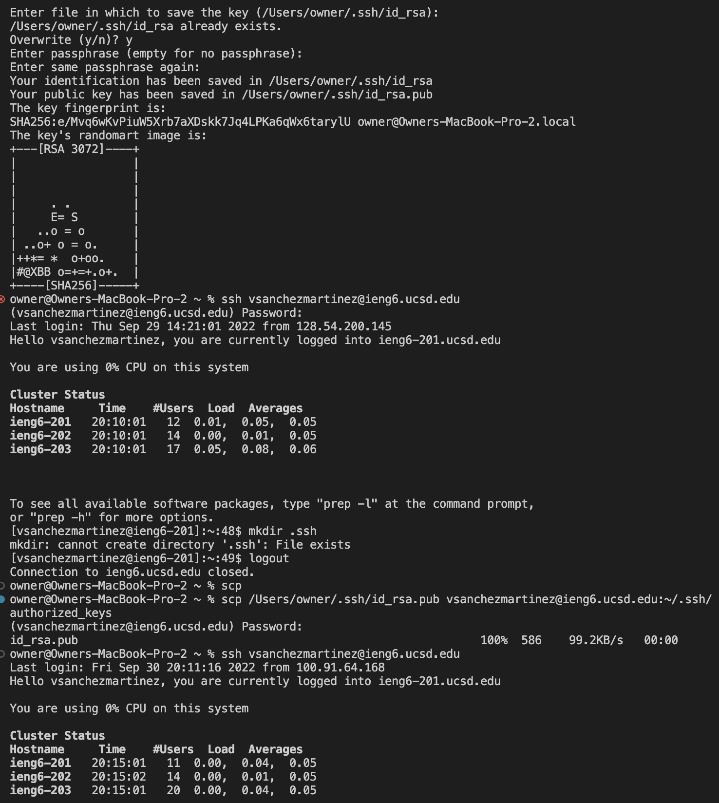
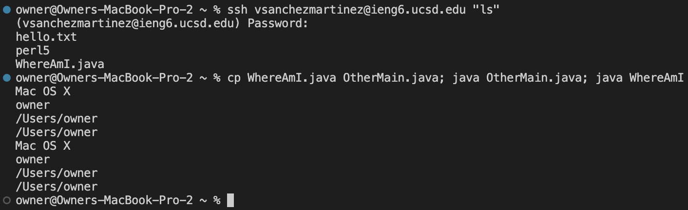

# Week 1 Lab Report #
**Installing VS Code**

- Before starting the lab, I had to install VS Code with this available link (https://code.visualstudio.com/)and downloaded the specific version for my laptop (OSX for Mac and Windows for PC) I chose OSX.

- This is what my VS Code looks like when I open it up but I had already used this application before. You can see what my recents were which were some of my PAs and my cloned github directory. Side note: if I wanted to open up this rendered markdown (a live person of me editing my repository) I could simply click the booklet with the magnifying glass on the top right.  

---
**Remotely Connecting** 

 
- For this specific section my CS 15L account didn't work so I had to use my gmail account. If you do want to use your CS 15L account, head over to (https://sdacs.ucsd.edu/~icc/index.php) where you type in your user name that corresponds to your UCSD email (without the @ucsd.edu) along with your student ID after. 

- Click the ETS account that starts with "cs15lfa22.." the two dots representing your unique letters associated with your account 
- Prior to starting up VS Code with the PA, I reset my password at this step and had to wait around 15-20 minutes but sadly the password change did not work. 

-To start using VS Code make sure you open up your rendered markdown by clicking on the book with a magnifying glass on the top right. Then you should see the copy of your directory and you can prop it down to see what it contains. Now, if you want to open up a terminal look towards the top bar of your laptop (since I have a Mac I look towards the top of my screen where the Apple logo would be) and you should see "terminal". Once you see this, click "new terminal". 

-In this new terminal is where I will be writing my commands. This is how I will be connecting to a remote computer. 
-I type in the command "ssh vsanchezmartinez@ieng.ucsd.edu" soley because my CS account was not working. Typically you would want to type in "SSH cs15lfa22(2 unique letters)@ieng.ucsd.edu. We use the SSH command because it stands for Secure Shell and its a way of safely connecting to another computer.  

-To clarify, the "client" would refer to my macbook while the remote server is the actions tied to my "@ieng6.ucsd.edu" account. 

**Trying Some Commands**

- During this part of the lab we were instructed to input some commands and see what would occur. 
- I did commands such as cd, cd ~, ls -lat, ls <directory>, and so on. 
- What I had noticed was that the simple cd command was not working on its own. 

**Moving Files with scp**

- This is the section where I copy a file from my macbook to a remote server.
- I created a file called WhereAmI, ran commands such as "Javac WhereAmI.java" and finding my file in my home directory. 

**Setting an SSH Key**

- Here we used the ssh-keygen command that creates a public and private key which I could use to copy to a server and save my login password
- This part was actually very tricky for me and took me a while but when it finally copied I had to re-enter my password, logout, and then was finally able to login without having to type my password 

**Optimizing Remote Running**

- Here I used the "ssh vsanchezmartinez@ieng6.ucsd.edu ls command to directly log into the server and get the home directory. 
- Since I had created my key, I did not have to type in my password. The other line on the terminal was a list of commands that I was able to type in and get several results printed out.
