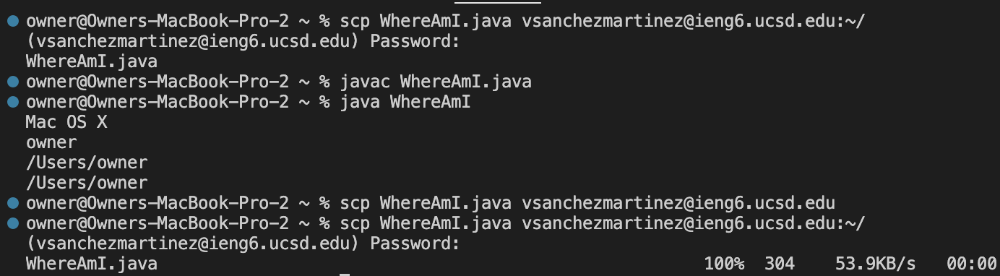
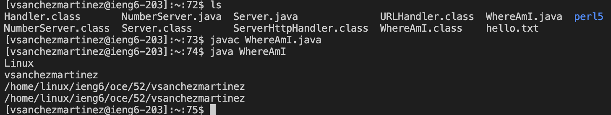
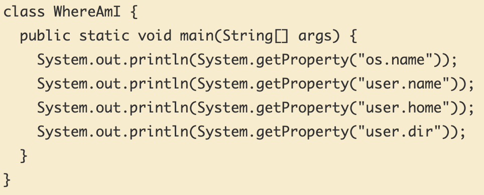

# Week 1 Lab Report #
**Installing VS Code**

- Before starting the lab, I had to install VS Code with this available link (https://code.visualstudio.com/)and downloaded the specific version for my laptop (OSX for Mac and Windows for PC) I chose OSX.

- This is what my VS Code looks like when I open it up but I had already used this application before. You can see what my recents were which were some of my PAs and my cloned github directory. Side note: if I wanted to open up this rendered markdown (a live person of me editing my repository) I could simply click the booklet with the magnifying glass on the top right.  

---
**Remotely Connecting** 

 
- For this specific section my CS 15L account didn't work so I had to use my gmail account. If you do want to use your CS 15L account, head over to (https://sdacs.ucsd.edu/~icc/index.php) where you type in your user name that corresponds to your UCSD email (without the @ucsd.edu) along with your student ID after. 

- Click the ETS account that starts with "cs15lfa22.." the two dots representing your unique letters associated with your account 
- Prior to starting up VS Code with the PA, I reset my password at this step and had to wait around 15-20 minutes but sadly the password change did not work. 

-To start using VS Code make sure you open up your rendered markdown by clicking on the book with a magnifying glass on the top right. Then you should see the copy of your directory and you can prop it down to see what it contains. Now, if you want to open up a terminal look towards the top bar of your laptop (since I have a Mac I look towards the top of my screen where the Apple logo would be) and you should see "terminal". Once you see this, click "new terminal". 

-In this new terminal is where I will be writing my commands. This is how I will be connecting to a remote computer. 

-I type in the command "ssh vsanchezmartinez@ieng.ucsd.edu" soley because my CS account was not working. Typically you would want to type in "SSH cs15lfa22(2 unique letters)@ieng.ucsd.edu. We use the SSH command because it stands for Secure Shell and its a way of safely connecting to another computer. 

-After this you should see "Are you sure you want to continue connecting (yes/no/[fingerprint])?", type yes, enter, and then you will be prompted to type in your password. You are now successfully logged onto the remote computer.

-To clarify, the "client" would refer to my macbook while the remote server is the actions tied to my "@ieng6.ucsd.edu" account. 

---
**Trying Some Commands**

 
-During this part of the lab we were instructed to input some commands and see what would occur. 

-I did commands such as cd, cd ~, ls -lat, ls <directory>, and so on. 

- some simple commands that I used: cd meant change directory (which didn't work because I did not change into anything specific)
- ~ circles back to the remote home directory so adding cd would change the directory to home 
- ls shows all files and things stored within the current directory. I would assume ls -lat is a more precise form of getting your files and current directories.
---
**Moving Files with scp**

 
 
 

-This is the section where I copy a file from my macbook to a remote server by using the scp command (secure copy).

-I do so by creating a file called WhereAmI.java on my own computer and putting this code in: 

 

-I then compile (javac WhereAmI.java) and then run it (java WhereAmI) after that I get information such as "Mac OS X", "owner", and "/users/owner"

-Next, I type the command scp (username)@ieng6.ucsd.edu:~/ to move this copy to the remote computer. Then, I typed ssh (user)@ucsd.edu and finally ls to check if WhereAmI was actually in the remote home directory (and it was). 
- I tested it out by compiling and running WhereAmI and this time instead of "Mac OS X" there was "Linux", my user, and directories. 
---
**Setting an SSH Key**

-Here we used the ssh-keygen command that creates a public and private key which I could use to copy to a server and save my login password
- I did this by typing in the terminal "ssh-keygen" on the client (my laptop)and a generated key showed up 
- When it asks what file the key should be saved in I pressed enter to get the default path "/Users/owner/.ssh/id_rsa"
- The path ending in "id_rsa.pub" is the public key and "id_rsa" is the private key but they are both stored in the .ssh directory 
- Next, I copy the public key by typing "ssh (user)@ieng6.ucsd.edu, entering my password, typing mkdir .ssh (make directory), and logging out. From there I go back to scp (similar to the last section) and type out the path with the ".pub" ending (user)@ieng6.ucsd.edu:~/.ssh/authorized_keys
- This should successfully copy the key from the client to the remote computer  
- This part was actually very tricky for me and took me a while but when it finally copied I had to re-enter my password, logout, and then was finally able to login without having to type my password 
---

**Optimizing Remote Running**

-Here I used the "ssh vsanchezmartinez@ieng6.ucsd.edu ls command to directly log into the server and get the home directory. 
-Since I had created my key, I did not have to type in my password.
-The commands that I typed out were: 
- ssh cs15lfa22@ieng6.ucsd.edu "ls": meaning I was logging directly into the remote computer and immediately wanting to print out my files and directories 
- cp WhereAmI.java OtherMain.java; javac OtherMain.java; java WhereAmI: this command was sort of confusing but my best guess would have been it is getting the class path of WhereAmI.java and OtherMain.java, compiling OtherMain,java, and running WhereAmI which is why it prints out "Mac OS X" (my laptop) and the directory.
