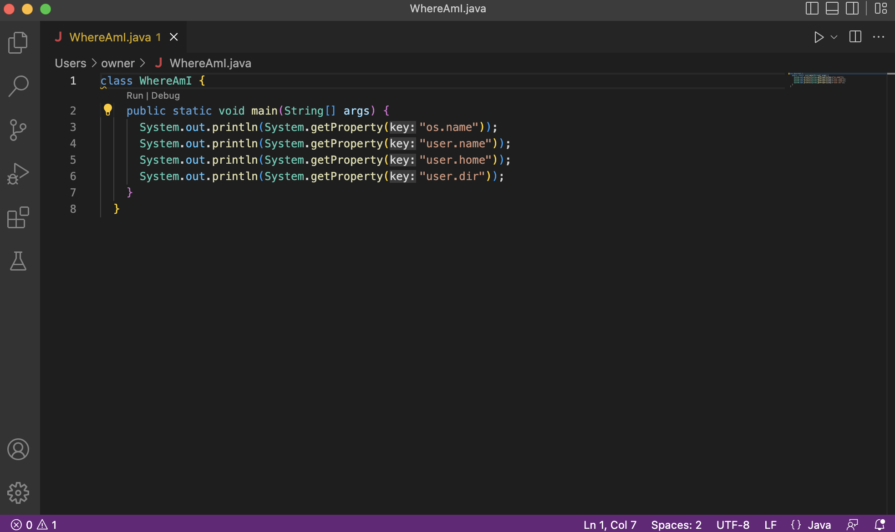

# Week 1 Lab Report #
**Installing VS Code**

- Before starting with the lab I had already installed VS Code due to starting on PA 0 beforehand. 
- I had followed these instructions a few days back on the PA 0 instructions so this is why my VS Code looks this way. 

**Remotely Connecting** 
 
- For this specific section my CS 15L account didn't work so I had to use my gmail account. 
- I was basically connecting to a remote computer through VS Code hence why I had to use "vsanchezmartinez@ieng6.ucsd.edu".
- To clarify, the "client" would refer to my macbook while the remote server is the actions tied to my "@ieng6.ucsd.edu" account. 

**Trying Some Commands**

- During this part of the lab we were instructed to input some commands and see what would occur. 
- I did commands such as cd, cd ~, ls -lat, ls <directory>, and so on. 
- What I had noticed was that the simple cd command was not working on its own. 

**Moving Files with scp**
-
